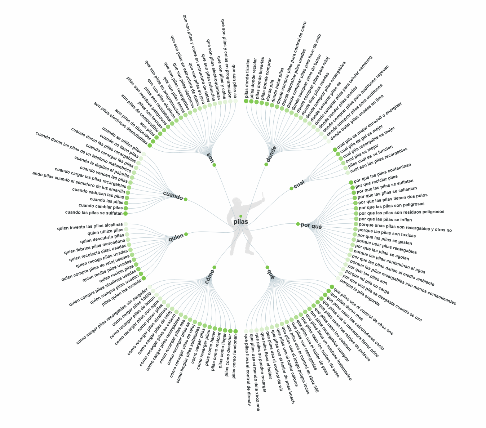
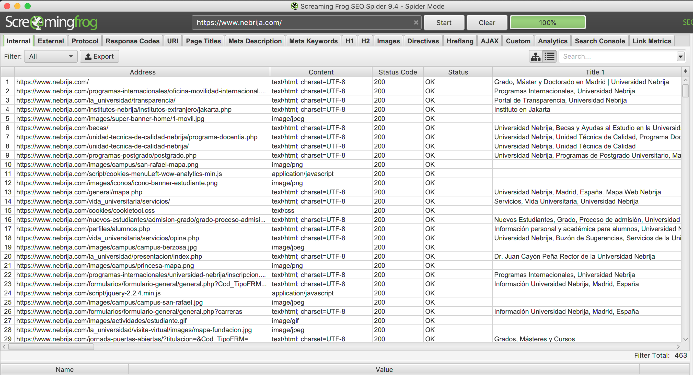

# 10 Computer problems and solutions

## 1. Keyword research (SEO, Growth)

* Tool: [Answer the public](https://answerthepublic.com) (free)

## 2. Kaggle (Machine Learning)

* Tool: [Kaggle](https://www.kaggle.com) (free)

## 3. BigML (Machine Learning)

* Tool: [BigML](https://bigml.com)

* Load dataset from https://bigml.com/dashboard/sources

## 4. OWASP (Security)

* Tool: [OWASP](https://owasp.org/www-pdf-archive/OWASP-Top-10-2017-es.pdf)

## 5. Zapier (No code)

* Tool: [Zapier](https://zapier.com)

## 6. SEO audit (SEO)

* Tool: [Screaming Frog](https://www.screamingfrog.co.uk/)

  

## 7. Web Analytics (Design)

* Resource: [Renfe review](https://perf.reviews/reviews/1.5-renfe.com/)

* Tools:
  * [web.dev](https://web.dev/)
  * [Woorank](https://www.woorank.com/es)
  * [Page Speed Insights](https://developers.google.com/speed/pagespeed/insights/?hl=es)

## 8. Web Scrapping (Developer)

* Tool: [Repl.it Ruby](https://repl.it/languages/ruby)

## 9. Python (Machine Learning)

* Tool: [Google Collaboratory](https://colab.research.google.com)

## 10. Data visualization (Data)

* Tool: [Fluorist](https://flourish.studio)
